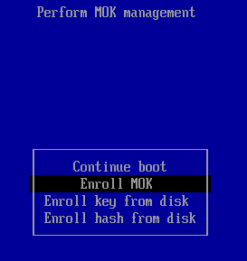
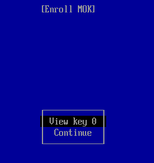
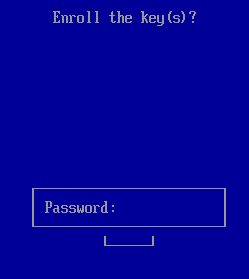
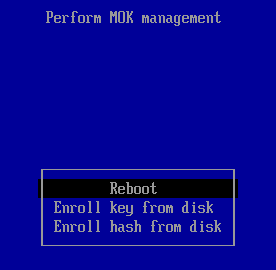
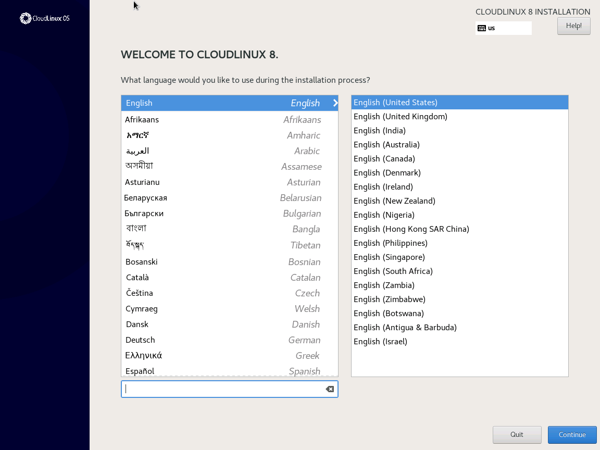
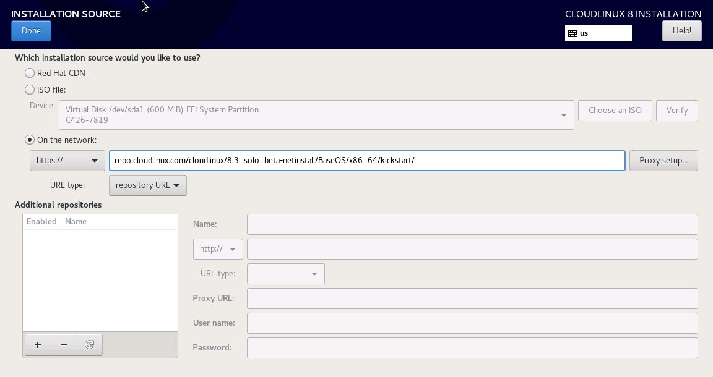
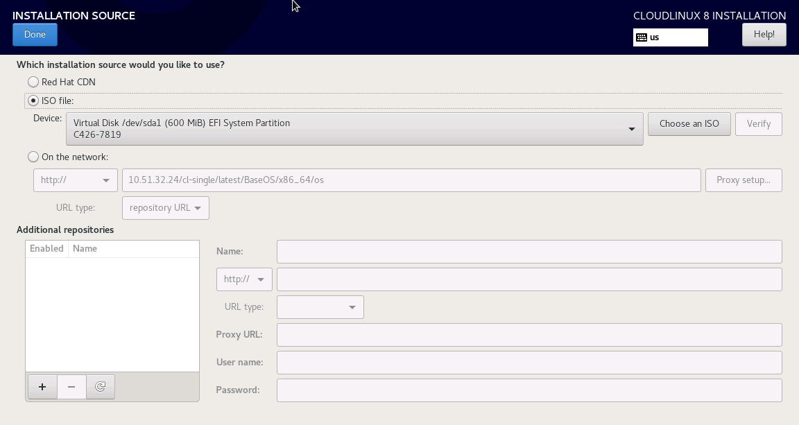
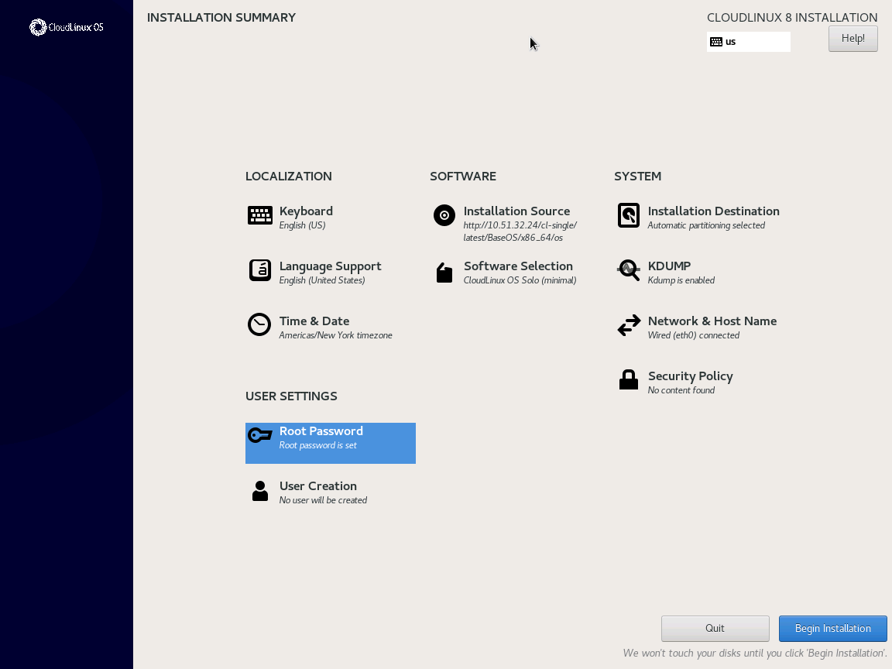

# Installation

[[toc]]

## Hardware compatibility

CloudLinux OS supports all the hardware supported by RHEL/CentOS/AlmaLinux, with few exceptions. Exceptions are usually hardware that require binary drivers, and that doesn't have any open source alternatives.

:::tip Note
CloudLinux OS does not support ARM-based CPUs (e.g. Graviton).
:::

:::warning Warning
In cases where your server hardware is incompatible with any version of RHEL/CentOS/AlmaLinux and CloudLinux OS or our components - we will not be able to provide assistance in adding such hardware support or solving possible issues related to such installation.
:::

:::tip Note
Replacing the server hardware affects specifications and support for such hardware from CloudLinux OS end.
It is most likely that the CloudLinux OS will stop working if you replace any hardware component on the server.

Example: the same HDD/SSD/NVMe model will have a new UUID and CloudLinux OS is mapped to old UUID which break the boot procedure.

In this case, we are not responsible for the CloudLinux OS operation and cannot assist you in restoring the server or adapting CloudLinux OS installation to the new hardware.
:::

There are some incompatible devices with **CL6**:

| |  | |
|-|--|-|
|**Device** | **Binary Driver** | **Source**|
|<span class="notranslate"> B110i Smart Array RAID controller </span> | hpahcisr | [https://h10032.www1.hp.com/ctg/Manual/c01754456](https://h20000.www2.hp.com/bizsupport/TechSupport/Document.jsp?objectID=c01732801)|
|<span class="notranslate"> B120i/B320i Smart Array SATA RAID Controller </span>  | hpvsa | [https://www8.hp.com/h20195/v2/GetPDF.aspx/c04168333.pdf](https://h20000.www2.hp.com/bizsupport/TechSupport/Document.jsp?objectID=c01732801)|
|<span class="notranslate"> SanDisk DAS Cache </span> |  | [https://www.dell.com/en-us/work/learn/server-technology-components-caching](https://www.dell.com/en-us/work/learn/server-technology-components-caching)|


With RHEL8 (**CloudLinux OS 8/CloudLinux OS 7 Hybrid**), some devices are no longer supported.
You can check the entire list here: [Hardware enablement considerations in adopting RHEL 8](https://access.redhat.com/documentation/en-us/red_hat_enterprise_linux/8/html/considerations_in_adopting_rhel_8/hardware-enablement_considerations-in-adopting-rhel-8#removed-hardware-support_hardware-enablement)

## Getting license

You will need a trial or payed activation key to be able to use your CloudLinux OS Solo server.

### Getting trial license

The trial activation key can be used to convert your server to CloudLinux OS. 

:::tip Note
The trial license subscription will work for 30 days.
:::

If you have any issues getting activation key or if you have any questions regarding using your 
trial subscription – contact [sales@cloudlinux.com](mailto:sales@cloudlinux.com) and we will help.

To get the activation key:

1. Register with CloudLinux Network: [https://cln.cloudlinux.com/console/register/customer](https://cln.cloudlinux.com/console/register/customer) (skip it if you already registered)
2. You will receive an email with activation link
3. Login at [https://cln.cloudlinux.com/console/auth/login](https://cln.cloudlinux.com/console/auth/login)
4. Choose the appropriate [CloudLinux edition](/introduction/) that fits your needs.
5. Click on `Get Trial Activation Key`

You will get a key that looks like: `12314-d34463a182fede4f4d7e140f1841bcf2`


## Converting existing servers

Sometimes it is required to convert already existing servers with `CentOS` or `AlmaLinux` and make them `CloudLinux OS`.

It is easy to convert your existing installation by cldeploy script. The process takes a few minutes and replaces just a handful of RPMs.

:::warning
Unlike [Fresh installation](#installing-new-servers), converting immediately requires CloudLinux OS license. 
Please refer to the [guide](#license-activation) to get activation key.
:::

### Requirements

Currently supported OS for conversion:
* CentOS 7
* AlmaLinux OS 8, AlmaLinux OS 9
* RockyLinux (installation only, no uninstall option)


:::warning Unsupported OS for conversion:
* CentOS 8
* CentOS Stream
:::


Supported control panels:
* cPanel ([Documentation](https://docs.cpanel.net/installation-guide/system-requirements-cloudlinux/))
* Plesk
* DirectAdmin
* CyberPanel ([Documentation](https://community.cyberpanel.net/t/1-convert-cyberpanel-to-cloudlinux-os-and-install-cagefs/174))
* InterWorx ([Documentation](https://appendix.interworx.com/current/nodeworx/plugins/install-use-cloudlinux-plugin-interworx.html))
* Webuzo ([Documentation](https://webuzo.com/docs/installing-webuzo/install-cloudlinux-os/))


:::warning Other control panels:
Control panels not mentioned in the list of supported panels have native integration or integration by the developer of such a panel.
We cannot guarantee the stability or correct operation of CloudLinux components on such panels.
:::

:::warning Warning:
Some CloudLinux components may not be supported by the control panel itself or the control panel has its own analog of such a component.
You can verify this information when reviewing the system requirements for installing a particular CloudLinux component.
:::


#### Note: CentOS 8 is EOL

CentOS 8 reached End Of Life (EOL) on December 31st, 2021.
If you would like to convert from CentOS 8 to CloudLinux OS 8, do the following:

* Convert CentOS 8 to AlmaLinux 8 using [almalinux-deploy](https://github.com/AlmaLinux/almalinux-deploy)
* Convert AlmaLinux 8 to CloudLinux 8 using [cldeploy](/cloudlinux_installation/#cldeploy-explained)


### Downloading and running conversion script

#### Key-based activation

If you want to use your activation key for activation, run the following commands:

```
yum install wget -y
wget https://repo.cloudlinux.com/cloudlinux/sources/cln/cldeploy
bash cldeploy -k ACTIVATION_KEY
```

Where `ACTIVATION_KEY` is the one that you got on previous step. 
Your CloudLinux OS edition will be detected automatically based on the `ACTIVATION_KEY` 

#### IP-based activation

If your reseller provides you ip-based license, run the following commands:

To convert server into the CloudLinux OS Shared edition:
```
$ sh cldeploy -i
```

To convert server into the CloudLinux OS Admin edition:
```
$ sh cldeploy -i --to-admin-edition
```

### Next steps
After successful conversion, reboot your system by running the following command:

```
reboot
```

Once you reboot - your server should be running with CloudLinux OS LVE kernel.

You may check the booted kernel with the following command:

```
$ uname -r
```

:::warning Note
If after rebooting you do not see the CloudLinux kernel (the kernel has the abbreviation LVE in its name)
then please consider check our [knowledgebase](https://cloudlinux.zendesk.com/hc/en-us/) or 
contact [support](https://cloudlinux.zendesk.com/hc/en-us/requests/new).
:::

:::warning Note
SELinux is not supported on CloudLinux OS 6 and 7. SELinux is supported on CloudLinux OS 8+,
but might not work or be compatible with control panels and various components.
:::

:::tip Note
At the end of conversion from CentOS 7.x to CloudLinux OS Shared 7, 
the cldeploy script converts CloudLinux OS Shared 7 to [CloudLinux OS Shared 7 Hybrid](/cloudlinux_os_kernel/#hybrid-kernels).
:::

Automatic hybridization will be performed for the AMD processors with the following CPU families:

* Zen / Zen+ / Zen 2 / Zen 3
* Hygon Dhyana

Automatic hybridization may be skipped by passing extra option '--no-force-hybridize'.
See also [advanced options for cldeploy](/command-line_tools/#cldeploy).

### Troubleshooting 

If you receive any troubles during the conversion process,
please feel free to search our [knowledgebase](https://cloudlinux.zendesk.com/hc/en-us) 
or contact our support and attach the conversion log (/var/log/cldeploy.log).

### How to enable secure boot for CloudLinux 9

#### Overview
CloudLinux 9 uses non-modified AlmaLinux 9 kernel.\
To make secure boot work with CloudLinux's kernel module you need to enroll CloudLinux secure boot key to your server.\
This procedure shows how to do it

#### Requirements
* UEFI support
* mokutil package installed
* Access to server's BIOS options menu and boot screen

#### Procedure
1. Download CloudLinux key
    1. `wget https://repo.cloudlinux.com/cloudlinux/SECURE-BOOT-KEY-cloudlinux-kmod.der`
2. Import the key
    1. `mokutil --import SECURE-BOOT-KEY-cloudlinux-kmod.der`
    2. When prompted, enter a password of your choice. This password will be used when enrolling the key into the MOK list.
3. Reboot server
    1. Upon rebooting, the "Shim UEFI key management" screen appears. Press any key withing 10 seconds to proceed.
4. Enroll the key

Select `Enroll MOK`\


Select `View key 0`\


Make sure that CloudLinux's Secure Boot Key information is displayed\
Press the Esc key when you are finished\


Select `Continue` on the screen from Step 2
It will ask "Enrol the key(s)?".\
Select `Yes/OK`\


Enter the password you used for importing the key (point 2.ii)\


Select `Reboot` (Older versions may say `Continue boot`)\


Now you can enable Secure Boot in BIOS options menu

#### Useful commands
* `mokutil --sb-state` to check current Secure Boot state
* `mokutil --list-enrolled` to show list of enrolled keys

#### If you wish to remove the CloudLinux key from the MOK list, follow the instructions below
:::warning Warning
Do not delete the key when secure boot is enabled - server will be unable to boot
:::

1. Disable Secure Boot
2. `mokutil --delete SECURE-BOOT-KEY-cloudlinux-kmod.der`
3. `mokutil --list-delete` (to check the key to be deleted)
4. Reboot the system and go through the MOK management process to complete the deletion from the MOK list.

### Technical details: cldeploy

By its design, CloudLinux OS Shared is very close to the upstream operating system - RHEL.
This makes the conversion process relatively straightforward, requiring just one reboot. 

#### Installation process

Here's what the cldeploy script does when you run it:

* Backups the original repository settings into <span class="notranslate">`/etc/cl-convert-saved`</span>.
* Backups RHEL system ID into <span class="notranslate">`/etc/cl-convert-saved`</span> (RHEL systems only).
* Installs CloudLinux repository settings & imports CloudLinux RPM key.
* Replaces redhat/centos-release/almalinux-release, redhat-release-notes, redhat-logos with CloudLinux versions.
* Removes cpuspeed RPM (as it conflicts with CloudLinux limits).
* Reinstall CloudLinux version of rhnlib/rhnplugin.
* Checks for binary kernel modules, finds replacement if needed.
* Detects OVH servers and fixes mkinitrd and possible boot issues.
* Detects Linode servers and fixes grub issues.
* Checks if LES is installed.
* Checks that <span class="notranslate">`/etc/fstab`</span> has correct <span class="notranslate">`/dev/root`</span>
* Checks for EFI and performs the necessary configuration.
* Installs CloudLinux kernel, lve-utils, liblve, lve-stats RPMs.
* Installs CloudLinux Manager for the supported control panels.
* Installs mod_hostinglimits Apache module <sup>*</sup>:
  * RPM install for supported control panels;
  * On Plesk, replaces psa-mod_fcgid* with mod_fcgid;
  * Perform CustomBuild tool execution for DirectAdmin.

#### Uninstallation process

Here's what the cldeploy script does, if one runs it to uninstall CloudLinux:

* Restores CentOS/AlmaLinux repositories, and almalinux-release/centos-release/release-notes/logos.
* Removes lve, mod_hostinglimits, lve-stats, lvemanager packages.
* mod_hostinglimits RPM is removed.

:::tip Note
**cldeploy doesn't remove the kernel** to prevent condition when server has no kernels and wouldn't boot. Instead, script provide the instructions on how you could remove it manually later, when it is safe to do so.
:::

On cPanel servers, rebuild of Apache with EasyApache will complete the conversion back, but doesn't have to be performed immediately.<sup> *</sup>
On DirectAdmin servers, rebuild of Apache with custombuild will complete the conversion back, but doesn't have to be performed immediately.

More information is also available here: [Uninstall CloudLinux](/cloudlinux_installation/#uninstalling).


## Installing new servers

All CloudLinux OS editions may be installed using one ISO and source.

### Downloading ISO

You can download the latest CloudLinux OS ISO and use it to install CloudLinux OS on your server:

* CloudLinux OS 9

  * x86_64 version: [https://www.repo.cloudlinux.com/cloudlinux/9/iso/x86_64/](https://www.repo.cloudlinux.com/cloudlinux/9/iso/x86_64/)

* CloudLinux OS 8

  * x86_64 version: [https://www.repo.cloudlinux.com/cloudlinux/8/iso/x86_64/](https://www.repo.cloudlinux.com/cloudlinux/8/iso/x86_64/)

* CloudLinux OS 7

  * x86_64 version: [https://repo.cloudlinux.com/cloudlinux/7/iso/x86_64/](https://repo.cloudlinux.com/cloudlinux/7/iso/x86_64/)

* CloudLinux OS 6

  * x86_64 version: [https://repo.cloudlinux.com/cloudlinux/6/iso/x86_64/](https://repo.cloudlinux.com/cloudlinux/6/iso/x86_64/)
  * i386 version: [https://repo.cloudlinux.com/cloudlinux/6/iso/i386/](https://repo.cloudlinux.com/cloudlinux/6/iso/i386/)


There are multiple ISO types available:

* `CloudLinux-*-boot.iso` - this ISO is made specifically for network installation and does not contain any packages inside.
* `CloudLinux-*-dvd1.iso` - this one contains all packages from network installation repository, 
  so you can set up any possible configuration without network access.
* `CloudLinux-*-minimal.iso` - this one contains only minimal set of packages to set up light server without GUI and Development tools.

### Installing using the Graphical User Interface

The graphical installation interface is the preferred method of manually installing CloudLinux OS. 
It allows you to have full control over all available settings, including disk partitioning and storage configuration.

The graphical mode is used by default when you boot the system from the local media. Mount and boot the image, then follow the steps.

#### Language selection

The first screen displayed is the language selection page.



First, find your preferred language in the left column and than select locale in the right one.
Selected language will be used during installation and also as a default language of the installed system.

After you select your language and locale, click `Continue` to confirm your selection 
and proceed to the [Installation Summary](#installation-summary). 

#### Installation summary

The Installation summary screen is the main dashboard of your installation parameters. 
Most of the options which can be configured during the installation can be accessed from here.


The summary screen displays links to other configuration screens, those links can be in 
several different states, which are graphically indicated:

- Grayed out link means that the installer is currently updating this sections. 
  Please wait a little before accessing this section. 

- A warning symbol next to an icon means that a screen requires your attention before you start the installation.

- Links without warning symbol mean that screen does not require your attention. 
  You can still change your settings in these screens, but it is not required to start installation.

#### Choosing the installation source

The first thing that you should define is where the system will be installed from.
There are basically two options:

- ISO file
- On the network


#### On the network source

Use this option to download packages to be installed from a network location. 
This is the preferred way as you automatically receive all critical bug fixes that may affect installation.

:::tip Note
Most likely your network is not configured by default, 
so you can see the URL configuration field greyed out, like on the screenshot below. Please refer to the Network Configuration screen first to set up a network connection.
:::


The correct installation URL for CloudLinux OS is

```text
https://repo.cloudlinux.com/cloudlinux/8/BaseOS/x86_64/kickstart/
```

Type in installation URL in the corresponding field, configure proxy if needed and press the `Done` button.




#### ISO file source

This option is primary used as an alternative when you don't have internet connection on a target server.
It is only available if you downloaded Minimal or DVD ISO which contains some bundled packages in.



Tick the `ISO file` checkbox and press the `Done` button.

#### Next steps

After clicking `Done`, you will be redirected to the [Installation Summary](./#installation-summary) screen
where [Installation source](./#installation-source) and [Software Selection](./#software-selection) links
will be greyed and the `Downloading package metadata` message wll be shown. 


Please hold on while that message disappears and proceed to the [Software Selection](./#software-selection) section.


#### Software Selection

The Software Selection screen allows you to choose a Base Environment and Add-ons. 
These options control which software packages will be installed on your system during the installation process.

This screen is only available if Installation Source is properly configured and only after the installer 
has downloaded package metadata from the source.

It is not possible to select specific packages during a manual installation, you can only select pre-defined environments and add-ons.

You should choose the CloudLinux edition that matches your license on this stage:
 


The available options are:
* to install CloudLinux OS Shared or Shared Pro, choose the `CloudLinux OS Shared/Pro (minimal)` environment on the left of the screen.
* to install CloudLinux OS Admin, choose the `CloudLinux OS Admin (minimal)` environment on the left of the screen.
* to install CloudLinux OS Solo, choose the `CloudLinux OS Solo (minimal)` environment on the left of the screen.


Then, on the right side of the screen, select one or more add-ons which you want to install by ticking the
check boxes next to each add-on.

#### Final preparations

Installation is almost done, all you need to do is to [configure your installation target](https://access.redhat.com/documentation/en-us/red_hat_enterprise_linux/7/html/installation_guide/sect-disk-partitioning-setup-x86)
using the `Installation Destination` menu and create your [Root Password](https://access.redhat.com/documentation/en-us/red_hat_enterprise_linux/7/html/installation_guide/sect-configuration-progress-menu-x86#sect-account-configuration-x86).

Doing that, the `Begin installation` button becomes blue, so click it.

 

After this point, the installation process actually starts and changes are being made to your selected disks.
It is not possible to go back to the Installation Summary and change any settings configured there; 
if you need to do so, you must wait for the installation process to finish, reboot your system, log in and change your settings 
on the installed system.

The bottom of the screen shows a progress bar and a message informing you of the current progress of the installation. 
When the installation finishes, you can press the Finish installation button
to reboot your computer and log in to your newly installed system.

:::warning Warning
Before you finish the installation and reboot, either remove the media
which you used to start the installation, or make sure that your system tries to boot 
from the hard drive before trying removable media. Otherwise, your computer will start the installer again instead of the installed system.
:::


#### Next steps

Reboot your system, login and check EULA which is located in the `/usr/share/cloudlinux-release/EULA`.

Next, [activate your installation](#license-activation) in order to get updates.


### License activation

To register your **CloudLinux OS** server with CloudLinux Network using activation key, run the following command:

```
$ yum install rhn-setup
$ /usr/sbin/rhnreg_ks --activationkey=<activation key>
```

Where &lt;activation key&gt; is like `1231-2b48feedf5b5a0e0609ae028d9275c93`

If you have IP based license, use the `clnreg_ks` command instead:

```
$ yum install rhn-setup
$ /usr/sbin/clnreg_ks --force
```


## Cloud provider images (CloudLinux OS Shared only)

* [OpenStack QEMU/KVM](https://download.cloudlinux.com/cloudlinux/images/#kvm-tab)
* [VMware](https://download.cloudlinux.com/cloudlinux/images/#vmware-tab)
* [Google Cloud Engine](https://download.cloudlinux.com/cloudlinux/images/#gce-tab)
* [Amazon Web Services](https://download.cloudlinux.com/cloudlinux/images/#aws-tab)
* [Alibaba Cloud](https://download.cloudlinux.com/cloudlinux/images/#ali-tab)
* [Xen](/cloudlinux_installation/#installing-new-servers)
* [CloudLinux Azure Images](/cloudlinux_installation/#cloudlinux-azure-images)

### CloudLinux Azure Images

We build and release CloudLinux 7.9 and CloudLinux 8.6 for Azure and upload to the [Mircosoft Azure Community Galleries](https://learn.microsoft.com/en-us/azure/virtual-machines/share-gallery-community?tabs=cli).

Images are built in both types Azure supports: *gen1 (BIOS based)* and *gen2 (UEFI based)*. CloudLinux Images could be found in the following regions: *West Europe, Germany West Central, Southeast Asia, East US, West US 2*. A publisher of CloudLinux Images in Azure is *cloudlinux*. Community gallery name is *cloudlinux-cbc76afd-63bc-4f6e-b801-65bd2f1ab0a0*.

How to use CloudLinux Image in Azure:

* When creating Virtual Machine, while choosing what OS should be used, click See al images.
   
* Switch from Marketplace to Community images.
   
* Search by typing *cloudlinux* or filter by *Publisher* which is also *cloudlinux* or *Azure Compute Gallery* which is *cloudlinux-cbc76afd-63bc-4f6e-b801-65bd2f1ab0a0*.
   
* Choose a suitable image. Check that the Publisher of the selected images is *cloudlinux* and Public Gallery Name is *cloudlinux-cbc76afd-63bc-4f6e-b801-65bd2f1ab0a0*.


### Xen images

:::tip Note
We do not provide Xen images of CloudLinux OS Shared anymore, use [ISO images](#installing-new-servers) instead 
:::

## Provider-specific guidelines (CloudLinux OS Shared only)

* [Amazon Web Services](/cloudlinux_installation/#aws)
* [H-Sphere](/cloudlinux_installation/#h-sphere)
* [DigitalOcean](/cloudlinux_installation/#digitalocean)
* [Linode](/cloudlinux_installation/#linode)
* [Virtuozzo and OpenVZ](/cloudlinux_installation/#virtuozzo-and-openvz)

### AWS

CloudLinux OS Shared image list can be found [here](https://download.cloudlinux.com/cloudlinux/images/#aws-tab)

If you are going to use CloudLinux OS Shared with cPanel image, you may find useful the following [article](https://cloudlinux.zendesk.com/hc/en-us/articles/360014130320-How-to-get-CloudLinux-OS-with-cPanel-AMI-working-on-AWS)

### H-Sphere

* [Requirements](/cloudlinux_installation/#requirements)
* [Converting from mod_fastcgi to mod_fcgid](/cloudlinux_installation/#converting-from-mod-fastcgi-to-mod-fcgid)
* [Older versions of H-Sphere](/cloudlinux_installation/#older-versions-of-h-sphere)

:::tip Note
For H-Sphere 3.5+
Please note, that CageFS and PHP Selector are not supported for H-Sphere
:::

#### Requirements

1. CloudLinux OS Shared with liblve 0.8 or later.
2. Apache 2.2.x or 1.3.
3. mod_suexec should be enabled.

To achieve optimal performance, we recommend to [convert from mod_fastcgi to mod_fcgid](/cloudlinux_installation/#converting-from-mod-fastcgi-to-mod-fcgid).

There is no need to install mod_hostinglimits – it comes built in with H-Sphere. Once you load kernel from CloudLinux OS Shared with liblve 0.8 or later – it will get enabled.

You can check if LVE is enabled by running:
<span class="notranslate"> </span>
```
$ ps aux | grep httpd | grep DLIBLVE
```

If you see no output, it means that Apache didn't pick up LVE. Try checking file <span class="notranslate">` /hsphere/shared/scripts/apache-get-env.sh`</span>

The following lines should be there:
<div class="notranslate">

```
if [ -e /usr/lib64/liblve.so.0 -o -e /usr/lib/liblve.so.0 ]; then
APENV_DSSL="$APENV_DSSL -DLIBLVE"
fi
```

</div>

If those strings are absent, you should add it, after:

<div class="notranslate">

```
else
APENV_DSSL='-DSSL'
fi
###
```

</div>

and before:

<div class="notranslate">

```
# this is used by apacheGetEnv.pm perl module
if [ "$1" = 'show' ] ; then
set | egrep "^APENV_"
fi
```

</div>

strings.

Restart Apache afterward.

:::tip Note
Don't forget to [convert from mod_fastcgi to mod_fcgid](/cloudlinux_installation/#converting-from-mod-fastcgi-to-mod-fcgid).
:::

#### Converting from mod_fastcgi to mod_fcgid

To achieve the best results in productivity and stability we recommend converting from <span class="notranslate">`mod_fastcgi`</span> to <span class="notranslate">`mod_fcgid`</span>.

:::tip Note
H-Sphere 3.6.3+
:::

1. Download our fcgi.conf file:
   
<div class="notranslate">

```
$ wget -O /hsphere/local/config/httpd2/fcgi.conf https://repo.cloudlinux.com/cloudlinux/sources/mod_fcgid-hsphere/fcgi.conf
```
</div>

2. Edit <span class="notranslate">`~httpd2/conf/extra/httpd-hostinglimits.conf`</span> to the following state:
   
<div class="notranslate">

```
######
LoadModule hostinglimits_module /hsphere/shared/apache2/modules/mod_hostinglimits.so

<IfModule mod_hostinglimits.c>
SkipErrors Off
AllowedHandlers cgi-script %php% fcgid-script application/x-miva-compiled
DenyHandlers hs-php5-script hs-php53-script hs-php54-script
Include /hsphere/local/config/httpd2/fcgi.conf
 
</IfModule>
#######
```
</div>

3. Go to <span class="notranslate">`P.Servers > web server [Config]`</span> and be sure to have enabled:
   * <span class="notranslate">`apache_version=2`</span>
   * <span class="notranslate">`apache_mpm=prefork`</span>
   * <span class="notranslate">`apache_fastcgi`</span>
   * <span class="notranslate">`apache_fcgid`</span>
   * <span class="notranslate">`PHP version/mode: php_fastcgi`*</span>

:::tip Note
*No changes needed to `httpd.conf.tmpl.custom` or `usermodule.phpmode` as this version provides its own mod_fcgid.
:::

#### Older versions of H-Sphere

1. Compile mod_fcgid module:
   
<div class="notranslate">

```
$ yum install gcc liblve-devel zlib-devel openssl-devel 
$ wget https://apache.osuosl.org//httpd/mod_fcgid/mod_fcgid-2.3.9.tar.gz
$ tar zxvf mod_fcgid-2.3.9.tar.gz
$ cd mod_fcgid-2.3.9/
$ APXS=/hsphere/shared/apache2/bin/apxs ./configure.apxs 
$ make
$ mv modules/fcgid/.libs/mod_fcgid.so /hsphere/shared/apache2/modules
```
</div>

2. Download and apply patch [https://repo.cloudlinux.com/cloudlinux/sources/mod_fcgid-hsphere/usemodule.phpmode.patch](https://repo.cloudlinux.com/cloudlinux/sources/mod_fcgid-hsphere/usemodule.phpmode.patch) to `/hsphere/local/config/scripts/usemodule.phpmode`:
   
 <div class="notranslate">

```
$ wget https://repo.cloudlinux.com/cloudlinux/sources/mod_fcgid-hsphere/usemodule.phpmode.patch 
$ patch /hsphere/local/config/scripts/usemodule.phpmode usemodule.phpmode.patch
```

</div>

3. If `/hsphere/local/config/httpd2/httpd.conf.tmpl.custom` does not exists – create it:
   
<div class="notranslate">

```
$ cp -rp /hsphere/local/config/httpd2/httpd.conf.tmpl /hsphere/local/config/httpd2/httpd.conf.tmpl.custom
```
</div>

Download and apply patch [https://repo.cloudlinux.com/cloudlinux/sources/mod_fcgid-hsphere/httpd.conf.tmpl.patch](https://repo.cloudlinux.com/cloudlinux/sources/mod_fcgid-hsphere/httpd.conf.tmpl.patch) to the <span class="notranslate">`/hsphere/local/config/httpd2/httpd.conf.tmpl.custom`</span>:

<div class="notranslate">

```
$ wget https://repo.cloudlinux.com/cloudlinux/sources/mod_fcgid-hsphere/httpd.conf.tmpl.patch 
$ patch --fuzz=3 /hsphere/local/config/httpd2/httpd.conf.tmpl.cusom  httpd.conf.tmpl.patch
```

</div>

4. Download pre-defined config file [https://repo.cloudlinux.com/cloudlinux/sources/mod_fcgid-hsphere/fcgi.conf](https://repo.cloudlinux.com/cloudlinux/sources/mod_fcgid-hsphere/fcgi.conf) to `/hsphere/local/config/httpd2`:

<div class="notranslate">

```
$ wget -O /hsphere/local/config/httpd2/fcgi.conf https://repo.cloudlinux.com/cloudlinux/sources/mod_fcgid-hsphere/fcgi.conf
```

</div>

5. Download our wrapper file [https://repo.cloudlinux.com/cloudlinux/sources/mod_fcgid-hsphere/php-wrapper](https://repo.cloudlinux.com/cloudlinux/sources/mod_fcgid-hsphere/php-wrapper) into <span class="notranslate">`/hsphere/shared/php5/bin/`</span> and make it executable:

<div class="notranslate">

```
$ wget -O /hsphere/shared/php5/bin/php-wrapper https://repo.cloudlinux.com/cloudlinux/sources/mod_fcgid-hsphere/php-wrapper
$ chmod 755 /hsphere/shared/php5/bin/php-wrapper
```

</div>

6. Change permissions for <span class="notranslate">`/hsphere/local/home`</span> to 755:
   
<div class="notranslate">

```
$ chmod 755 /hsphere/local/home
```

</div>

7. Edit <span class="notranslate">`~httpd2/conf/extra/httpd-hostinglimits.conf`</span> and add DenyHandlers, so section will look like:
   
<div class="notranslate">

```
<IfModule mod_hostinglimits.c>
SkipErrors Off
AllowedHandlers cgi-script %php% fcgid-script application/x-miva-compiled
DenyHandlers hs-php5-script hs-php53-script hs-php54-script 
</IfModule>
```

</div>

8. Configure physical server from H-Sphere admin > E.Manager > P.Servers > server_name [parameters] icon, settings should be:
 
<div class="notranslate">

```
apache_version = 2
apacha_fastcgi = yes
apache_status = yes
```
</div>


9. Set PHP configuration to:
    
<div class="notranslate">

```
php_libphp5 enabled but not default
php_fastcgi5 enabled and is default
```
</div>


Other options could be configured according to personal needs.

When done - click <span class="notranslate">_SUBMIT_</span> to apply changes.

:::tip Note
After updating H-Sphere software on web server with CloudLinux OS Shared you need to re-apply step 2 (patch usemodule.phpmode) and restart apache with `/hsphere/shared/scripts/apache-restart` script.
:::

### DigitalOcean

* [Adding CloudLinux OS Shared image to DigitalOcean](/cloudlinux_installation/#adding-cloudlinux-os-shared-image-to-digitalocean)

How to make CloudLinux OS Shared work on DigitalOcean:

DigitalOcean doesn't support custom kernels. The droplet (VM) always runs DigitalOcean's kernel. CloudLinux OS Shared requires its own kernel. To enable CloudLinux OS Shared work on DigitalOcean droplets, we provide ability to boot into CloudLinux OS Shared kernel using `kexec` functionality.

How does this work:

* <span class="notranslate"> cldeploy </span> script checks for presence of <span class="notranslate">`/etc/digitalocean`</span>. If the file detected, we assume that this is DigitalOcean droplet;
* <span class="notranslate">`kexec-tools`</span> are installed;
* <span class="notranslate">`kexec`</span> script will be created in <span class="notranslate">`/etc/rc.d/init.d/`</span> and set to run right after <span class="notranslate">`rc.sysinit`</span>.

When executed, script <span class="notranslate">`/etc/rc.d/init.d/kexec`</span> detects the latest installed CloudLinux OS Shared kernel, and loads that kernel.

If the system cannot boot into CloudLinux OS Shared kernel (due to any reason), subsequent reboot will skip <span class="notranslate">`kexec`</span>, allow droplet to boot into DigitalOceans' kernel.

To disable booting into Cloudlinux OS Shared kernel, run:

<div class="notranslate">

```
chkconfig --del kexec
```
</div>

To re-enable booting into CloudLinux OS Shared kernel, run:
<div class="notranslate">

```
chkconfig --add kexec
```
</div>

#### Adding CloudLinux OS Shared image to DigitalOcean

Custom images are Linux distributions that have been modified to fit the specific needs of DigitalOcean users. You can find some basics of importing a custom CloudLinux OS Shared image below.

Importing custom images to DigitalOcean is free, as you are only charged for the storage of your image. To save money, you can easily import your image, start a Droplet from your image, and delete the image, so you don’t incur any storage costs.

Below, we will describe how to add a qcow2 (QEMU/KVM) CloudLinux OS Shared image as a custom image. You can find more information on image options at [https://www.digitalocean.com/docs/images/custom-images/overview/](https://www.digitalocean.com/docs/images/custom-images/overview/)

1. To choose the right image, navigate to [https://download.cloudlinux.com/cloudlinux/images/#kvm-tab](https://download.cloudlinux.com/cloudlinux/images/#kvm-tab). Several different images are available for download (with and without a control panel).


2. Copy the link for the image you are going to use and log into [cloud.digitalocean.com](https://blog.digitalocean.com/custom-images/cloud.digitalocean.com).

Click <span class="notranslate">_Images_</span> on the left of the screen and then choose <span class="notranslate">_Custom Images_</span>. Click the <span class="notranslate">_Import via URL_</span> button and paste the CloudLinux OS Shared image link.


There are several options here, but the most important is <span class="notranslate">_Choose a datacenter region_</span>, i.e. which datacenter region your Droplets should be created in for this image.


Click the <span class="notranslate">_Upload Image_</span> button and wait until the image is successfully uploaded.

3. Add your public key to access your droplets using key-based authentication: navigate to the <span class="notranslate">_Security_</span> sidebar menu and click the <span class="notranslate">_Add SSH Key_</span> button.

You can find more information about creating/adding SSH keys in [this article](https://www.digitalocean.com/docs/droplets/how-to/add-ssh-keys/).


4. You will then be able to start a CloudLinux OS Shared Droplet using the image.
   
   :::tip Note
   Your Droplet will be created in the same datacenter that your custom image resides in.
   :::


5. Now, use your preferred SSH client software to connect to your Droplet. You can find more information on SSH client setup [here](https://www.digitalocean.com/docs/droplets/how-to/connect-with-ssh/).


### Linode

* [CloudLinux OS Shared on Linode KVM](/cloudlinux_installation/#cloudlinux-os-shared-on-linode-kvm)
* [CloudLinux OS Shared on Linode Xen](/cloudlinux_installation/#cloudlinux-os-shared-on-linode-xen)

:::warning Warning
If you are installing CloudLinux OS Shared 8, please make sure you’ve read [https://www.linode.com/community/questions/19397/i-just-upgraded-my-centos-8-linode-and-now-it-wont-boot-how-do-i-fix-this-proble](https://www.linode.com/community/questions/19397/i-just-upgraded-my-centos-8-linode-and-now-it-wont-boot-how-do-i-fix-this-proble)
:::


#### CloudLinux OS Shared on Linode KVM

To install CloudLinux OS Shared 7 on Linode KVM server you should perform the following steps:

1. Deploy CL to your Linode following the steps from [this section](/cloudlinux_installation/#converting-existing-servers)

2. Install grub on your system:
   
<div class="notranslate">

```
yum install grub2
```
</div>

3. Add to <span class="notranslate">`/etc/default/grub`</span> the following parameters:
   
<div class="notranslate">

```
GRUB_TIMEOUT=10
GRUB_CMDLINE_LINUX="console=ttyS0,19200n8"
GRUB_DISABLE_LINUX_UUID=true
GRUB_SERIAL_COMMAND="serial --speed=19200 --unit=0 --word=8 --parity=no --stop=1"
```
</div>

4. Update grub config:
   
<div class="notranslate">

```
grub2-mkconfig -o /boot/grub/grub.cfg
```
</div>

5. Edit your Linode profile, change the boot settings to <span class="notranslate">`GRUB 2`</span> .

6. Reboot your Linode.

After reboot you will have fully operational CloudLinux OS Shared 7 system and can proceed with other configuration you need.

#### CloudLinux OS Shared on Linode Xen

To install CloudLinux OS Shared 7 on Linode Xen please perform the following steps:

1. Deploy CL to your Linode following the steps from [this section](/cloudlinux_installation/#converting-existing-servers).

2. Create the file <span class="notranslate">`/boot/grub/menu.lst`</span> with the following content:
   
<div class="notranslate">

```
timeout 5
title CloudLinux 7.1, $KVERSION
root (hd0)
kernel /boot/vmlinuz-$KVERSION root=/dev/xvda1 ro quiet
initrd /boot/initramfs-$KVERSION.img
```
</div>

where <span class="notranslate">`$KVERSION`</span> is the version of the installed CloudLinux OS Shared 7 kernel.

:::tip Note
You will need to update <span class="notranslate">`/boot/grub/menu.lst`</span> manually after every kernel update.
:::

3. Switch boot settings to <span class="notranslate">`pv-grub-x86_64`</span> and switch off <span class="notranslate">`Auto-configure networking`</span> in Linode settings.

4. Reboot your Linode.

In case if you will migrate to KVM later you will need only switch the boot settings to <span class="notranslate">`GRUB 2`</span>.


### Virtuozzo and OpenVZ

* [Virtuozzo 7 and OpenVZ 7](/cloudlinux_installation/#virtuozzo-7-and-openvz-7)
* [Virtuozzo 6 and OpenVZ 6](/cloudlinux_installation/#virtuozzo-6-and-openvz-6)


#### Virtuozzo 7 and OpenVZ 7


To use CloudLinux Shared Pro in Virtuozzo container, please update the next packages to the specified versions (or higher):  

* alt-php-ssa-0.3-4
* alt-php-xray-0.5-8
* cloudlinux-linksafe-1-5.2
* accelerate-wp-1.0-11
* lvemanager-7.7.5-2
* alt-python27-cllib-3.2.32-1
* pam_lve-0.4-3	
* lve-wrappers-0.7.7-1
* lve-utils-6.4.3-1
* cagefs-7.5.1-1
* liblve-2.1-11
* tuned-profiles-cloudlinux-0.2-3


#### Available functionality
 
* [Lsapi](/cloudlinux_installation/#lsapi)
* [AccelerateWP](/cloudlinux_installation/#acceleratewp)
* [Hardened PHP](/control_panel_integration/#hardened-php)
* [Website monitoring and Slow Site Analyzer](/lve_manager/#website-monitoring-tool-and-slow-site-analyzer)
* [X-Ray](/cloudlinux-os-plus/#x-ray)
* [CageFS](/cloudlinux_installation/#cagefs)
* [PHP Selector](/cloudlinux_installation/#php-selector)
* [Wizard](/cloudlinux_installation/#cloudlinux-wizard)
* [Dashboard](/cloudlinux_installation/#dashboard)
* [Python Selector](/cloudlinux_installation/#python-selector)
* [Node.js Selector](/cloudlinux_installation/#node-js-selector)


#### Requirements

* [Virtuozzo 7](https://wiki.openvz.org/Virtuozzo) as server system
* Virtuozzo container with CloudLinux Shared Pro 8 
* cloudlinux-updates-testing repo is enabled (+ `yum clean all`)

#### How to install 

1. Prepare Virtuozzo container with ostemplate almalinux-8-x86_64
2. Enter to the container 
3. Install cPanel:
```
cd /home && curl -o latest -L https://securedownloads.cpanel.net/latest && sh latest
```
4. Download and start cldeploy:
```
wget https://repo.cloudlinux.com/cloudlinux/sources/cln/cldeploy
chmod 775  cldeploy
./cldeploy -k SHARED_PRO_CLN_KEY_HERE --testing-repo
```
5. You don't need to restart the container after the cldeploy script finished execution.


#### CloudLinux Wizard

Wizard is a tool to set up CloudLinux OS components.

In the current version only the lsapi module can be installed.


#### Dashboard

CloudLinux OS Shared dashboard provides a quick overview of statistics and all administrative information for server administrators.

In the current version only statistics about the lsapi module is available.


#### Lsapi 

To install Lsapi via CloudLinux Wizard, please turn off mod_ruid2 in EasyApache 4 -> Apache Modules.

:::tip Note
For EasyApache select `Currently Installed Packages`.
:::


:::tip Note
Currently mod_suexec is not available in containers and will be released in future versions. Just ignore this message, click "ok" and continue installing lsapi via the Wizard.
:::

You can find the complete lsapi documentation [here](https://docs.cloudlinux.com/cloudlinux_os_components/#apache-mod-lsapi-pro).

#### AccelerateWP 

If you'd like to try Smart Advice and AccelerateWP you should participate in the Beta tester program. To become a beta tester, please send your request at our Beta program page with the signup form [here](https://www.cloudlinux.com/wp-performance/). Once you submit the request, we will send you a confirmation email with program details, terms of use, and installation instructions.

All additional information can be found [here](https://docs.cloudlinux.com/cloudlinux-os-plus/#acceleratewp).


#### CageFS

You can fing CageFS documentation [here](/cloudlinux_os_components/#cagefs).

:::warning Attention!
[Kernel config variables](/cloudlinux_os_kernel/#kernel-config-variables) are not available for the Virtuozzo container!
:::


#### PHP Selector

#### How to install

1. To install via SSH, update your packages in the container:
   ```sh
   yum update alt-python27-cllib pam_lve lve-wrappers lve-utils liblve tuned-profiles-cloudlinux lvemanager
   ```
2. The following commands can be executed via SSH or via CloudLinux Wizard 
   **Via SSH:**
   ```sh
   yum install cagefs
   yum groupinstall alt-php
   cagefsctl –init
   ```
   **Via CloudLinux Wizard (cPanel only):**
   
3. Make sure compatible handlers are installed:
   **Via SSH:**
   ```
   yum install ea-apache24-mod_suexec
   yum install ea-apache24-mod_suphp
   ```
   **Or**<br>
   [Install lsapi](/cloudlinux_os_components/#installing-on-cpanel-servers-with-easyapache-4)<br>
   **It's also possible to install via CloudLinux Wizard:**<br>
   The `mod_suexec` and `mod_suphp` can be installed via cPanel EasyApache4 installation tool.<br><br>
4. Make sure users are enabled in the CageFS:
   

Useful links:

* [General information and requirements](/cloudlinux_os_components/#general-information-and-requirements-5)
	* [Installation and update](/cloudlinux_os_components/#installation-and-update-4)
	* [Installation instructions for cPanel users](/cloudlinux_os_components/#installation-instructions-for-cpanel-users)
* [Uninstalling](/cloudlinux_os_components/#uninstalling-3)
	* [Configuration and using](/cloudlinux_os_components/#configuration-and-using)
	* [Bundled PHP extensions](/cloudlinux_os_components/#bundled-php-extensions)


#### Python Selector 

The installation of Python Selector is available via CloudLinux Wizard. Aslo, the information about manual installation can be found [here](/cloudlinux_os_components/#cpanel-2).

Information about working with Python Selector via GUI can be found [here](/lve_manager/#python-selector-2).

#### Node.js Selector

#### General information 

General information can be found [here](cloudlinux_os_components/#general-information-and-requirements-7). 

#### Requirements  

Information about Requirements can be found [here](/cloudlinux_os_components/#requirements-2).

#### Limitations 

Information about limitations can be found [here](/cloudlinux_os_components/#limitations). 

#### Installation for cPanel

To use Node.js Selector, install Node.js packages by running the following command:

```
yum groupinstall alt-nodejs
```

CloudLinux OS Shared 7 supports both `ea-ruby24-mod_passenger` and `ea-ruby27-mod_passenger`.

:::tip Note
The `ea-apache24-mod-alt-passenger` is deprecated in favor of `ea-ruby24-mod_passenger` and `ea-ruby27-mod_passenger`.
:::


If during Node.js Selector usage on cPanel servers you get "ENOMEM npm ERR! errno-12" error, try to increase Memory limit in cPanel WHM → Server Configuration → Tweak Settings → System → Max cPanel process memory, then restart cPanel service with the following command to apply changes:

```
systemctl restart cpanel.service
```

#### Node.js deployment 

Information about Node.js deployment can be found [here](/cloudlinux_os_components/#node-js-deployment).

#### Remote usage of Node.js interpreters 

Information about Remote usage of Node.js interpreters can be found [here](/cloudlinux_os_components/#remote-usage-of-node-js-interpreters).

#### Node.js Selector UI

Information about working with Node.js Selector via UI can be found [here](/lve_manager/#node-js-selector-2).


#### FAQ

Q: My CloudLinux Manager-> options menu is empty.

A: You don't have AccelerateWP enabled and PHP X-Ray enabled, so there is nothing to configure. Install and enable any of those features to see settings. This minor UI issue will be fixed in future updates.

Q: Dashboard says both: that data is updated and that I need to refresh it and both panels never disappear.

A: Just click the refresh button and reload the page, data will be loaded soon.

Q: Website monitoring does not appear enabled after clicking the toggle.

A: Just reload the page, the feature will be displayed as active.

Q: Website monitoring proposes me to enable autotracing while I disable it.

A: Issue is known and will be fixed soon.


#### Known restrictions and issues

1. We do not recommend using [disk quota](https://access.redhat.com/documentation/en-us/red_hat_enterprise_linux/7/html/storage_administration_guide/ch-disk-quotas) inside of containers - PHP Selector may be not functional for a user when disk quota is exceeded for the user.

2. The following systemd directives may break CageFS inside containers:
   * PrivateDevices
   * PrivateMounts
   * PrivateTmp
   * ProtectSystem
   * ReadOnlyDirectories
   * ReadWriteDirectories
   * InaccessibleDirectories
   * ProtectHome

#### Virtuozzo 6 and OpenVZ 6

#### Installation

:::tip Note
Make sure all containers are stopped prior to doing this operation. Or reboot the server after the installation.
:::

:::tip Note
Please make sure you have <span class="notranslate">`vzkernel-headers`</span> and <span class="notranslate">`vzkernel-devel`</span> packages installed.
:::

<div class="notranslate">

```
yum install vzkernel-headers vzkernel-devel

$ wget -P /etc/yum.repos.d/ https://repo.cloudlinux.com/vzlve/vzlve.repo
$ yum install lve-kernel-module
```

</div>


This will setup LVE module for VZ kernel, as well as DKMS to update that module each time VZ kernel is updated.

After this is done, you can add LVE support for any container on a node, at any time.

To make CloudLinux OS Shared work inside VZ container, VZ node has to be enabled. This should be done for any container where LVE support needs to be added:


<div class="notranslate">

```
$ vzctl set CT_ID --devnodes lve:rw --save
```

</div>

To disable LVE support for Container:

<div class="notranslate">

```
$ vzctl set CT_ID --devnodes lve:none --save
```

</div>

Inside the container, follow [standard CloudLinux installation procedures](/cloudlinux_installation/#converting-existing-servers).

CloudLinux OS Shared license is required for each VZ container.

:::tip Note
Some servers require increasing `fs.ve-mount-nr` on host node, otherwise CageFS will throw errors.
:::

To increase `fs.ve-mount-nr`, on a host node:

1. add <span class="notranslate">`fs.ve-mount-nr = 15000`</span> to <span class="notranslte">`/etc/sysctl.conf`</span>;

2. apply it with the <span class="notranslate">`sysctl -p`</span> command.

In very rare cases the value should be increased higher, up to 50000.

#### Available functionality

* CageFS
* PHP Selector
* max entry processes
* mod_lsapi
* MySQL Governor


## LILO boot loader

CloudLinux OS can be deployed on servers that don't have grub installed, by installing <span class="notranslate">`хороgrub`</span> first.

To do that:

1. Make sure grub and kernel packages are not excluded. Edit file <span class="notranslate">`/etc/yum.conf`</span> and check <span class="notranslate">`exclude=`</span> line for presence of <span class="notranslate">`kernel* grub*`</span>.

2. Backup lilo config file:
   
<div class="notranslate">

```
mv /etc/lilo.conf /etc/lilo.conf.bak
```
</div>

3. Convert to CloudLinux OS Shared using <span class="notranslate"> [deploy2cl](/cloudlinux_installation/#converting-existing-servers)</span> utility.

4. Check <span class="notranslate">`grub.conf`</span> – it should be configured automatically:
 
 <div class="notranslate">

 ```
 # cat /boot/grub/grub.conf
default=0
timeout=5
 title CloudLinux Server (2.6.18-294.8.1.el5.lve0.7.33)
      kernel /boot/vmlinuz-2.6.18-294.8.1.el5.lve0.7.33 root=/dev/sda1  ro
      root (hd0,0)
      initrd /boot/initrd-2.6.18-294.8.1.el5.lve0.7.33.img
      title linux centos5_64
      kernel /boot/bzImage-2.6.33.5-xxxx-grs-ipv4-64 root=/dev/sda1  ro
      root (hd0,0)
```
</div>

5. Install grub to master boot record:
   
 <div class="notranslate">

 ```
 /sbin/grub-install /dev/sda
 ```
 </div>

6. Reboot and check that you are running CloudLinux OS Shared. <span class="notranslate">`uname -r`</span> should show something like: <span class="notranslate">`2.6.18-294.8.1.el5.lve0.7.33`</span>.

## Uninstalling

You can always uninstall CloudLinux OS. In this case, the system will be converted back to AlmaLinux or CentOS* (Depends on what system the conversion was done from).

:::warning
CentOS Linux 8 reached End Of Life (EOL) on December 31st, 2021. You can still uninstall CloudLinux and return to CentOS 8, but we don't guarantee stable operation of the system and its repositories after this action.
:::

The following actions will be taken:

1. LVE related packages will be removed.
2. CloudLinux OS Shared repositories & <span class="notranslate">yum</span> plugin will be removed.
3. AlmaLinux or CentOS* repositories will be set up.

In the end, the script will provide instructions on how to finish the conversion back to AlmaLinux or CentOS*. That will require removal of CloudLinux OS Shared kernel (manual step), and installation of AlmaLinux or CentOS* kernel (if needed).

:::warning
Do not forget to free up a CloudLinux OS Shared license by removing the server from the [Servers section of your CLN account](https://docs.cln.cloudlinux.com/dashboard/#servers). After that, if you don't intend to use the license anymore, you can [remove it](https://docs.cln.cloudlinux.com/dashboard/#cloudlinux-os-activation-keys) to avoid being billed for it. 
:::

To uninstall CloudLinux OS, run:

```
$ wget -O cldeploy https://repo.cloudlinux.com/cloudlinux/sources/cln/cldeploy
$ sh cldeploy -c
```

Now you have converted back to AlmaLinux or CentOS* and it is the time to install kernel.

To delete CloudLinux OS kernel, run (change the kernel package name to the one you've been using):


```
rpm -e --nodeps $(rpm -qa | grep kernel | grep lve)
```

To install new AlmaLlinux or CentOS* kernel once you deleted CloudLinux OS Shared kernel, run the following command:

```
yum install kernel
```

If `yum` says that the latest kernel is already installed, it is OK.

Please check your bootloader configuration before rebooting the system.

To remove unused kmods and lve libs, run:

```
yum remove lve kmod*lve*
```

Kernel package and related LVE packages should be deleted and the required kernel will be installed.

Before the reboot, the following command should be executed for restoring Apache and httpd.conf without mod_hostinglimits.

**For EasyApache 3:**

```
/scripts/easyapache --build
```

**For EasyApache 4:**

```
/usr/local/bin/ea_install_profile --install /etc/cpanel/ea4/profiles/cpanel/default.json
```

:::tip Note
Some of the packages from CloudLinux OS repo will still be present. They are the same as AlmaLinux or CentOS* packages, and don't have to be removed. They will be updated in the future from AlmaLinux or CentOS* repositories, as new versions come out.
:::
